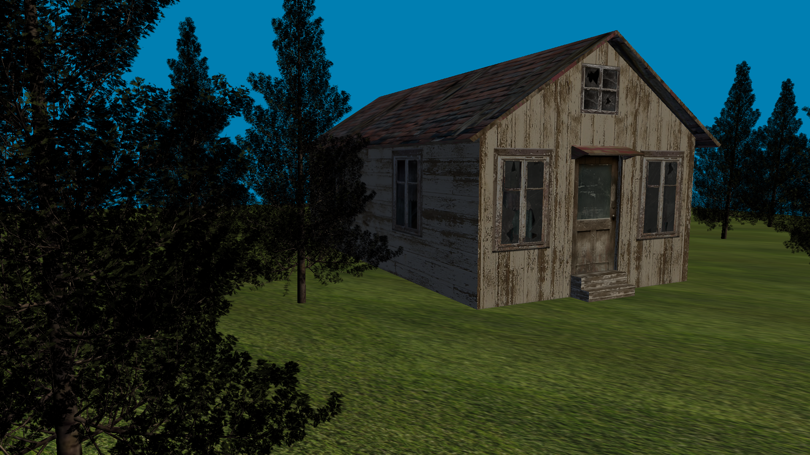
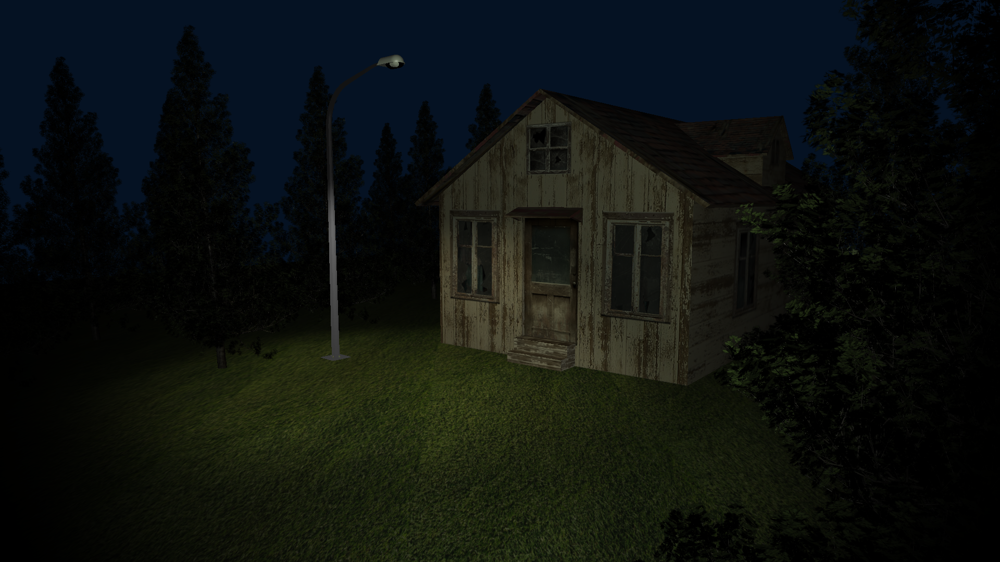
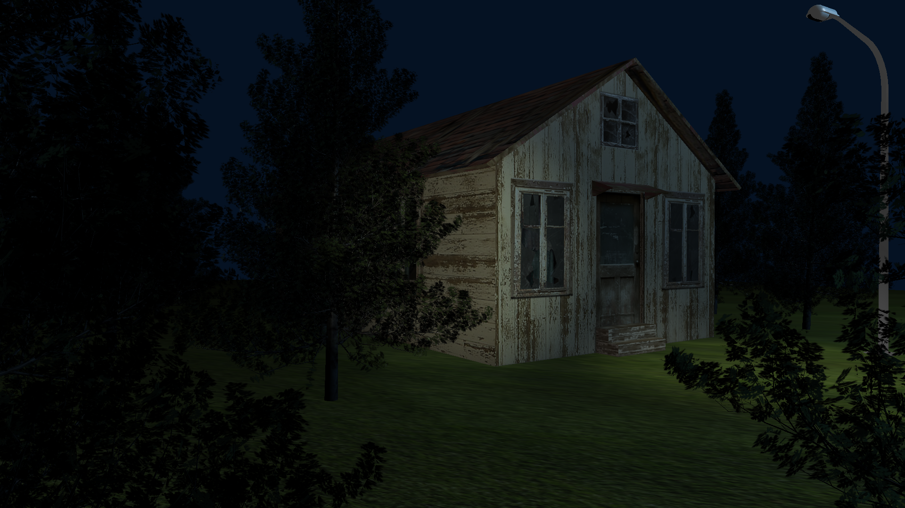

# RenderingFramework
This is an OpenGL real-time rendering framework built as a personal project. The goal of the framework is to serve as a tool for easy scene creation and editing. The project is still under development.

# Requirements
Since the framework is intended mainly for personal use, cross-platform compatibility is currently not a goal of the project. Similarly, modern features of c++ and OpenGL are mostly used, even though a wide hardware support is not guaranteed.

Specifically, the framework requirements are as follows:
- Windows OS;
- Support of c++ 17;
- Support of OpenGL 4.5 Core Profile.

# Libraries used
The framework makes use of the following libraries:
- [GLFW](https://www.glfw.org/) - window management and setting up the OpenGL context;
- [GLAD](https://github.com/Dav1dde/glad) - loading OpenGL functions;
- [stb_image.h](https://github.com/nothings/stb/blob/master/stb_image.h) - importing textures from files;
- [Assimp](http://www.assimp.org/) - importing 3D models.

# Components
Currently, the framework is divided in two layers - *Math* and *Graphics*. 
The Math layer provides basic functionality for performing calculations with vectors, matrices, and quaternions. Additionally, it contains some Bounding Volume classes and a set of useful math functions.
The Graphics layer is responsible for managing geometry, transformations, and lighting and for preparing the scene for rendering. It includes a camera class that handles mouse-and-keyboard control in real time.

# Preparaton Resources
Many resources were used during the development of the project. A non-exhaustive list is presented:
- *Mathematics for 3D Game Programming and Computer Graphics, Third edition*, E.Lengyel;
- *OpenGL Superbible: Comprehensive Tutorial and Reference (7th Edition)*, G.Sellers et al.;
- *Graphics Shaders: Theory and Practice, Second Edition*, M.Bailey;
- *Game Engine Architecture, 2nd Edition*, J.Gregory;
- [https://learnopengl.com/](https://learnopengl.com/);
- [http://ogldev.atspace.co.uk/index.html](http://ogldev.atspace.co.uk/index.html).

# Future development
The following features are to be introduced:
- Effective resource management;
- A scenegraph that makes use of parent-child relations;
- Frustum culling;
- Physically-based rendering.

# Screenshots

